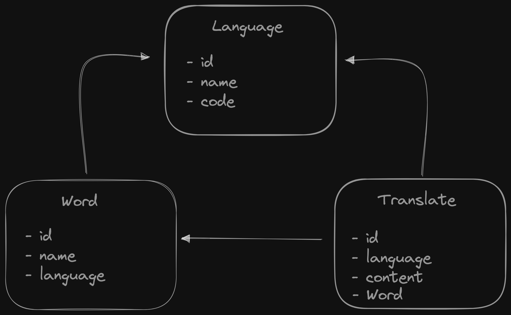

# GORA

This is a random word project.



### Run
```shell
go run .
```

### Build
```shell
go build
```

### Dockerize
```shell
docker-compose build .
docker-compose run
```

### Deploy to Heroku
You can deploy to heroku. You should follow the steps in below link
[Heroku Deploy](https://devcenter.heroku.com/articles/getting-started-with-go)

#### Note for Heroku
- You must setup **PostgreSQL**
If you have ``heroku-cli``, you can run the below command.
```shell
 heroku addons:create heroku-postgresql:hobby-dev
```
You shouldn't forget to set the DB information to ENV in heroku. _(ex: DB_HOST, DB_USERNAME)_
- You should change go version.
```shell
heroku goVersion go1.17
heroku config:set GOVERSION=go1.17
heroku config:set GLIDE_SKIP_INSTALL=true
```
## Packages
- [GORM](https://gorm.io)
- [Fiber](https://gofiber.io)
- [PostgreSQL](https://www.postgresql.org)